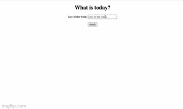

### Day 1: July 15, 2022 - Friday

#### Todays's Progress

• Started and finished Class 01 lecture on YouTube - INTRO<br>
• Start Class 01 homework - [Coursera course "Learning How To Learn"](https://coursera.org/share/ace875e4dd605145d75886055799dee7)<br>
• Set an action plan for completing the course<br>

- Mon-Fri 11AM-7PM with the pomodoro method and 1hr for lunch break<br>
- Sat-Sun Watch at least 1 class<br>

• Connected with folks on Discord - joined the mid July thread in #catchupcrew<br>

#### Thoughts

• As soon as I watched the first video, my mind went "this is exactly what I need and have been looking for". Leon brought so much energy and feeling his passion, energized mine! I know I'm not going to be bored and I genuinely like him as a person and feel thrilled to have him as a teacher.<br>

• I love that one of the first hw is "Learning how to learn"... it shows he's thought of everything especially starting at the basics and building a strong foundation. He emphasizes active recall and using ANKI (web note cards that are designed to focus on your most difficult to learn topics to fully master level based on an algorithm) which again, I love and agree with.<br>

• I have completed the Responsive Web Design certificate from freeCodeCamp and foundations of The Odin Project so I feel like I have a strong hold on markup languages HTML& CSS and the basics of JavaScript. Previous discord messages say you can skip to the 9hr "Frontend Crash Course" and just review what you need to. However, I know I have nothing to lose by revisiting them especially when Leon explains the concepts in such an easy way to grasp.<br>

"This is a marathon, not a sprint."<br>

---

### Day 2: July 18, 2022 - Monday

#### Todays's Progress

• Started and finished Class 02 lecture on YouTube - HTML <br> - followed along the brownies.html lab<br>
• Finished Class 01 homework - [Coursera course "Learning How To Learn"](https://coursera.org/share/ace875e4dd605145d75886055799dee7)<br>

#### Thoughts

• I found the Coursera course far more interesting than I originally thought. It taught me literally how to learn/take tests and the science behind the brain's thought process. HIGHLY RECOMMEND 10/10<br>

- focus mode (high concentration) and diffuse mode (moving your body allows the brain to wander and make connections to what you learned in focus mode) are both VITAL in learning... this is where the pomodoro method comes in<br>
- active recall, over a spaced out period of time leads to long term memory<br>
- sleep is VERY IMPORTANT because it allows the brain to grow so reviewing before you sleep can be beneficial aka focus mode then diffuse mode when sleeping<br>

• Class 2 was more of introductions and then a review of html for me. I was happy that I was able to complete the lab portion without any problem or confusion reaffirming my knowledge of html.<br>

---

### Day 3: July 19, 2022 - Tuesday

#### Todays's Progress

• Started and finished Class 03 lecture on YouTube - HTML<br>
• Completed Class 02 homework - [bcc.html](./class02-materials/bbc.html) ✔️<br>
• Completed Class 03 homework - HTML layout for [Tech Crunch](./class-03-materials/tech-crunch.html) and [Khan Academy](./class-03-materials/khan-academy.html) ✔️<br>
• Started and finished Class 04 lecture on YouTube - CSS<br>
• Started Class 04 homework - [Simple Site Lab](./class04-materials/simple-site-lab/simple-site.html)<br>
• Took the five minute [typingtest.com](www.typingtest.com) and got 64wpm<br>
• Practiced typing with [www.keybr.com](www.keybr.com) and got 82 wpm, stuck on q character<br>
• Read [learnlayout.com](www.learnlayout.com)<br>

#### Thoughts

• Class 3 dove a lot into structuring HTML and assigning semantic tags. Learned that we should try to use semantically correct tags over div. The labs were super easy for me to complete!<br>

• Class 4 touched on CSS and learnlayouts was a good website to cover the basics of the box model and common layout elements. I just started doing ANKI and just by making the cards, I can feel myself retaining the knowledge. <br>

- rules of Cascade, specificity and relationships<br>

• REALLY enjoyed the video assigned to watch before class and added to my [Youtube motivation playlist](https://youtube.com/playlist?list=PLxQMbVxcoynL5lkksJY8l3FS4yL8jWMAi)<br>

- "In order to be successful, you have to want it as much as you want to breathe."<br>
- "The pain you feel today is a strength you'll feel tomorrow."<br>

"Go deep, not wide." - go deep with material and not spreading yourself too thin/wide. <br>

P.S. ✔️ are for homeworks that needed to be turned in on either [codepen](www.codepen.com/jasminepvo) or [glitch](glitch.com/jasminepvo)

---

### Day 4: July 20, 2022 - Wednesday

#### Todays's Progress

• Started and finished Class 05 lecture on YouTube - CSS Layout<br>
• Took ANKI notes during lecture<br>
• Completed Class 05 lab - [15 Minutes of Pain](./class05-materials/15-min-of-pain-layout/index.html)<br>
• Completed Class 04 homework - [Simple Site Lab](./class04-materials/simple-site-lab/index.html) ✔️<br>
• Completed Class 05 homework - [Layout 1](./class05-materials/three-layouts/layout-1/index.html) ✔️<br>
• Completed Class 05 homework - [Layout 2](./class05-materials/three-layouts/layout-2/index.html) ✔️<br>
• Completed Class 05 homework - [Layout 3](./class05-materials/three-layouts/layout-3/index.html) ✔️<br>
• Started Class 06 lecture on YouTube Review HTML/CSS<br>

#### Thoughts

• Navy Seals Video in my [Youtube motivation playlist](https://youtube.com/playlist?list=PLxQMbVxcoynL5lkksJY8l3FS4yL8jWMAi)<br>

- "If you want to change the world, don't back down from the sharks."<br>

• HACKS FOR MAC<br>

- Digital color meter is built in to grab colors for design<br>
- Countdown is built in and useful for Pomodoro method<br>
- To comment: select text then command + / (command + forward slash) <br>

• Class 5 - vomit code for now and refactor later aka clean up the code, put it in a bag and throw it away. Note: don't watch this lecture while eating, that gif of the chunky milk was horrendous. Other than that, I'm enjoying the active recall by still reviewing topics from Class 1. Everything feels drilled into my brain and I've been getting good sleep so cheers to memory consolidation. 🥂<br>

- reiterating rules of Cascade, specificity and relationships<br>
- floats, apparently more common in the industry<br>
- separate css folder for style.css sheets to address separation of concerns<br>
- sleepytime.com was mentioned to track your sleep

• Hurray! I finished the css homeworks. My perfectionism kicked in while doing the Simple Site lab and I think it's pretty accurate other than making the border responsive with the background color. I have no idea on how to do that YET but I'm waiting to watch the responsive lecture. Three layouts using ONLY float was actually easier than I thought it would be. This display layout confused me on freeCodeCamp and TOP but Leon explained it so well that I'd like to say I'm pretty good with floats now 😎<br>

---

### Day 5: July,21 2022 - Thursday

#### Todays's Progress

• Finished Class 06 lecture on YouTube and completed all in-class labs/pushed to Github<br>
• Took ANKI notes during lecture<br>
• Started Class 07 lecture on YouTube - Responsive CSS<br>
• Completed Class 06 homework - 15 Min of Pain Responsive ✔️<br>
• Started and finished Class 09 lecture on YouTube - Networking <br>

BONUS: Attend Startups Oasis Networking in ATL at ATDC @7PM  🤝🏼<br>

#### Thoughts

• The motivational video for the day was by Eric Thomas again. I listened first thing when I woke up and the aggressive energy definitely got me going for the day. It felt like a push in the right direction so I enjoyed it.<br>

• Class 06 reviewed HTML & CSS with 4 coding labs in class which I loved. Active learning is where I stay the most focused and retain the most information. I've been making web pages but didn't think to make a template file. Again, I love the cool little tips that add value to my coding. Touched on responsive websites which will be next class - so excited for this!<br>

- normalize.css -> default styling that is consistent upon every browser
- reset.css -> scorch the earth and get rid of everything single default that comes from the browser, start from scratch
- media queries -> give us the ability to display certain rules at certain screen sizes for responsiveness. Ex. this rule only applies when the screensize is between 0 and 600 pixels<br>

```
@media screen and (max-width: 600px)
  h1 {
    color: blue;
  }
}
```

• Class 07 learned responsiveness to make content accessible across all devices. Continued on to networking portion which I took tons of notes over. Then had my networking meetup at night that went amazing! I got to meet so many cool, nice people in the startup world and learn about the Atlanta ecosystem. So much fun, honestly and makes me so excited!<br>

❗️ Don't click apply to a job and stop.. network. make sure an eagle picks up your resume. find 3 individuals already in tech and have 2 coffee chats every week so when you finish, you'll have x connections (x = 3 * #ofweeks so.. 150=5*30)<br>
❗️ Networking is making friends, say their name!! Stranger -> Acquaintance -> Friend -> Referral -> Coworker (The referral might get a bonus from the company and you might skip first round interview) WAYS TO FIND: Meetups.com, conferences, google interest + conference or #100devs-events (attend for free by volunteering!!! never eat alone, ask in discord), community groups (codeforamerica has different chapters, hackathons, womenwhocode chapter), apps like (Lunchclub or Bumble Bizz), talk to friends & family and tell them you're a software engineer. more on notion... <br>

---

### Day 6: July 22, 2022 - Friday

#### Todays's Progress

• Video call to help another member understand floats and responsiveness<br>
• Finished Class 07 lecture on YouTube - Responsive CSS<br>
• Started and finished Class 08 lecture on YouTube - Bad CSS<br>
• Started Class 08 homework - <br>

#### Thoughts

• Felt awesome to be able to help Tosin and she said it clicks now! I love teaching and giving whatever I can (even though it's still early knowledge I can't wait to have more and be able to help more) to help others.<br>

• Class 08 was tying everything we've done up to this point into making real website layouts. I like his baddie Tina emphasis on writing bad code for now. Just get it done! That's how you learn is by making mistakes, not trying to get it done perfectly the first time. Homework is hefty but.. I'M EXCITED TO START! <br>

- Dribble.com for designs

"Get rid of the fear. We're baddies and we write bad code. The sooner you give up on perfection. The sooner you embrace that and just try to write code of any shape size or form, your world changes. Free yourself. In the process of writing bad code, you'll find things to change or update but you have to start and you'll get better. Get here first and be Tina." <br>

---

### Day 7: July 23, 2022 - Saturday

#### Todays's Progress

• Started and finished Class 08 homework pt. 1 - [Layout Replica of TechCrunch](./techcrunch-layout-template/index.html)✔️<br>
<br>

#### Thoughts

• Today did not involve lecture, just homework. I spent about 5 hours making this trying to perfect the spacing/overall css. I know I'm getting better thought because I didn't have to use any outside resources but man, it took awhile. Still enjoyed it though.<br>

---

### Day 8: July 24, 2022 - Sunday

#### Todays's Progress

• Started Class 10 lecture on Youtube - CSS Review<br>
• Started Class 08 homework pt. 2 - [Layout Replica of Khan Academy](./khanacademy-layout-template/index.html)<br>
• Started Independence Day<br>

#### Thoughts

• Not much today since I was out with friends but still started on the layout for Khan Academy. The homework is taking longer than I anticipated since we're only allowed to use floats and styling is not my forte but I'm getting better. Fell asleep during the movie but I'll finish it tomorrow!<br>

---

### Day 9: July 25, 2022 - Monday

#### Todays's Progress

• Finished Class 08 homework pt. 2 - [Layout Replica of Khan Academy](./khanacademy-layout-template/index.html)✔️<br>
<br>
• Started Class 08 homework pt. 3 - [Layout Replica of BBC](./bbc-layout-template/index.html)<br>
• Finished Independence Day<br>

#### Thoughts

• Layout 2 took 4 hours this time instead of 5 hahah, I'm making progress and learning quicker. Little hacks that made me happy..<br>

- CSS: line-height for spacing between lines<br>
- Shift Command (<> arrow key) to select entire line<br>
- Using custom fonts<br>

```
@font-face {
  src: url(./rondo/rondo.ttf);
  font-family: rondo;
}
```

---

### Day 10: July 26, 2022 - Tuesday

#### Todays's Progress

• Went on an interview<br>
• Completed Java vending machine assessment<br>
• Finished Class 08 homework pt. 3 - [Layout Replica of BBC](./bbc-layout-template/index.html)✔️<br>

#### Thoughts

• The interview was with a startup for financial bookkeeping software. Good experience and got to see a popular co-working space for tech startups called Atlanta Tech Village. Completed a take home assessment to build a vending machine in Java which consumed most of my time.<br>
• Learned I don't need to be spending so much time trying to make the layouts pixel perfect. I am a perfectionist so being a baddie writing bad code is DIFFICULT for me. But I am learning to move on and come back later, slowly but still learning. Perfectionism is a hard habit to break.<br>

---

### Day 11: July 27, 2022 - Wednesday

#### Todays's Progress

• Made a commit to [#FitDevs](https://fitdevs-withkat.github.io/Support/landing_page/)<br>
• Started and finished Class 10 lecture on Youtube - CSS Review <br>
• Started and finished Class 10 homework - [Source Layout](./source-layout/index.html)✔️<br>
• Started and finished Class 10 homework - [Ground Layout](./level-ground-layout/index.html)✔️<br>

#### Thoughts

• Firstly, I am overjoyed that someone made a community for fit devs on Twitter. S/o to Kat. Fitness means so much to me and forever has a special place in my heart. Here's the commit I made:

```
{
  "name": "Jasmine Vo",
  "url": "https://github.com/jasminepvo",
  "image": "https://github.com/jasminepvo.png",
  "why": "To inspire and help those just starting their journey and also be inpsired by other members",
  "weekly": ["Gym 5x/week on my program", "Drink half a gallon of water/day", "Consume healthy and balanced diet with enough protein intake", "Sleep 6+ hrs/day", "Stretch between pomodoro breaks/day"],
  "goal": "To live an abundantly happy and healthy life",
  "location": "Atlanta, GA - USA"
}
```

Looking forward to making more contributions to this open source project!<br>
• Ground layout only took me 3 hours this time! I am making progressive enhancement which makes me feel really good. Discovering new tips as well.

- fontawesome for icons, I copied and pasted the kit into my template 📧<br>
- Follow these steps to take a full-page screenshot:
  1. Open Chrome’s menu.<br>
  2. Head to More tools > Developer tools.<br>
  3. Click the three-dot icon from the top-right corner and select Run command. Also, you can press Ctrl+Shift+P on Windows or Command+Shift+P on Mac.<br>
  4. Type screenshot into the search box.<br>
  5. Select Capture full-size screenshot.<br>
  6. Once Chrome takes the screenshot, it should save it into your Downloads folder. Voila!<br>

• AHHHH I FINISHED SOURCE LAYOUT IN UNDER 2 HOURS!!! I'm getting quicker i'm so proud and it actually looks decent or as my boyfriend would say it looks "professional". So happy!!!!<br>


---

### Day 12: July 28, 2022 - Thursday

#### Todays's Progress

• Started and finished [Mayanwolfe Explains CSS Floats](https://www.youtube.com/watch?v=sjdsDxqt8vY)<br>
• Started Class 10 homework - [Cuisine Restaurant](./restaurant-layout/index.html)<br>

#### Thoughts

• The floats video was super helpful even though I felt comfortable with floats already, it reaffirmed my knowledge and then added useful tips for images, headers and spacing! Glad someone reccomended it.

- Outline with wireframe layout before adding text/content. Also use these rules if you want your child section to be inherited in your parent section

```
*,
*::before,
*::after {
  box-sizing: inherit;
}

html,
body {
  height: 100%;
}
```

- Specify your sections with dimensions of height and width to avoid trouble

```
section{
  height: varies //example would be 50%;
  width: varies //example would be 100%;
}
```

- for images that overflow:

```
img{
  width: 100%;
}
### for the section the image is in ###
section{
  overflow: hidden;
}
```

---

### Day 13: July 29, 2022 - Friday

#### Todays's Progress

• Continued Class 10 homework - [Cuisine Restaurant](./restaurant-layout/index.html)<br>

#### Thoughts

• Honestly was feeling a little burnt out from pushing so hard to finish these layouts. I took a rest day just as you would when working out. Still did 10 minutes to get a little bit in though.

---

### Day 14: July 30, 2022 - Saturday

#### Todays's Progress

• Continued Class 10 homework - [Cuisine Restaurant](./restaurant-layout/index.html)<br>

#### Thoughts

• STILL working on the restaraunt layout. There are so many additional techniques being used to learn: text overlay on images, slideshow images, bottom border nav. Also had to dig for the original images. Spent WAY too much time on these things.

---

### Day 15: July 31, 2022 - Sunday

#### Todays's Progress

• Finished Class 10 homework - [Cuisine Restaurant](./restaurant-layout/index.html)✔️<br>

#### Thoughts

• FINALLY DONE!!! Putting this away for now. My brain definitely needed to go into diffuse mode so things could click instead of me staring at the screen for an hour wondering why it's not looking how I imagine it. For hair salon, I plan to work the wireframe without any content to get a good positioning on everything and make it easier for myself.

---

### Day 16: August 1, 2022 - Monday

#### Todays's Progress

• Started and finished Class 10 homework - [Hair Salon](./hair-salon-layout/index.html)✔️<br>
• Started [JavaScript Crash Course - Traversy Media](https://www.youtube.com/watch?v=hdI2bqOjy3c)<br>
• Started and finished Class 11 lecture on Youtube - CSS Layouts & Flexbox<br>

#### Thoughts

• Finished the wireframe for hair salon in 1 hour so I'm pretty happy about that! The wireframe and time away really helped things click and not overcomplicate it anymore. The lecture was a good review (and showed how much time would have been saved using flex instead of float) but I am sooo ready to move on to JavaScript tomorrow!!!

---

### Day 17: August 2, 2022 - Tuesday

#### Todays's Progress

• Listened to motivational video: [I still have a soul](https://youtu.be/01CL029k7pU)<br>
• Started and finished Class 12 lecture on Youtube JavaScript <br>
• Read and completed the tasks [javascript.info - Variables](https://javascript.info/variables)✔️<br>
• Read and completed the tasks [javascript.info - Function Basics](https://javascript.info/function-basics)✔️<br>
• Listened to motivational video: [What will you do with it? - Eric Thomas](https://youtu.be/dV9worye5g0)<br>
• Started and finished Class 13 lecture on Youtube - JavaScript <br>

#### Thoughts

• I have missed the motivational videos so much, it was definitely what I needed. First class of JavaScript was great! Leon brought so much energy, it really got me pumped. I've gone over manipulating the DOM before but idk, the way he explains it.. things just click faster.

• I LOVED Class 13! Especially the bachelor examples with toggling pictures with an event listener, I can definitely think of ways to use this. Huge bachelor fan also! The temperature converter was so cool and so simple the way he did it. Really feel like I'm getting a good understanding of manipulating the DOM.

- Good Pseudo Code = Good Code 🤝🏼 ALWAYS think through the steps in plain language before writing any code. Pseudo code gives us direction.

---

### Day 18: August 3, 2022 - Wednesday

#### Todays's Progress

• Start and finish Class 12 homework - Delete all js and redo - [Background Picker](./background-picker-globe/index.html)✔️<br>
• Start and finish Class 12 homework - Delete all js and redo - [Simple Calculator](./class12-materials/)✔️<br>
• Start and finish Class 12 homework - Delete all js and redo - [What is today?](./class12-materials/)✔️<br>
• Read and completed the tasks [javascript.info - Function Expressions](https://javascript.info/function-expressions)✔️<br>
• Read and completed the tasks [javascript.info - Arrow Function Basics](https://javascript.info/arrow-functions-basics)✔️<br>
• Read [javascript.info - The JS Way Ch. 4](https://github.com/thejsway/thejsway/blob/master/manuscript/chapter04.md)<br>
• Start and finish Class 13 homework - Delete all js and redo - [JS Tasks](./class13-materials/)✔️<br>

#### Thoughts

• YOOOOO, at first I was super confused on how to add the li element in JavaScript and realized I am big braining and overanalyzing this too much. Added the li element in html, adjust the styling to css to fit the new li, then added my JS function and BOOM! I got it!! It clicked and I was able to redo it without peaking!!! Here are the results for the homework:<br>


<br>

---

### Day 19: August 4, 2022 - Thursday

#### Todays's Progress

• Started and finished Class 14 lecture on Youtube - Functions <br>
• Start and finish Class 14 homework - Delete all js and redo - [JS Tasks](./class14-materials/)✔️<br>
• Started Class 15 lecture on Youtube - Freelancing <br>

#### Thoughts

• Went over a lot of functions today and I feel really good about them. This is where my knowledge of programming fundamentals is coming to play and knowing C++/Java has been super useful. They say you only need to learn one language and the programming fundamentals.. then learning another language is easy. THEY WERE RIGHT. Picking up on JavaScript incredibly fast so I'm REALLY happy!!!<br>

---

### Day 20: August 5, 2022 - Friday

#### Todays's Progress

• Finished Class 15 lecture on Youtube - Freelancing<br>
• Started Class 15 homework - Setup your [portfolio](./portfolio/index.html)✔️<br>

#### Thoughts

• "It's about the value you provide, not the tools you use." Freelancing class was insanely good! He went over everything, I still can't believe this is free haha. I love that he had office hours to answer more questions also. Everything is on my notion! As for the homework, I'm excited to get started. <br>

---

### Day 21: August 6, 2022 - Saturday

#### Todays's Progress

• Continued Class 15 homework - Setup your [portfolio](./portfolio/index.html)✔️<br>

#### Thoughts

• Looked at a couple templates, my OCD/perfectionist is coming out and spent way too much time on this. It's so difficult for me to pick one of these and I've been contemplating with the idea of making my own. Have friends in town so didn't get much done.<br>

---

### Day 22: August 7, 2022 - Sunday

#### Todays's Progress

• Continued Class 15 homework - Setup your [portfolio](./portfolio/index.html)✔️<br>
• Started and finished Class 15 homework - Draft your [proposal]()✔️<br>

#### Thoughts

• Friends still in town.. but I got my proposal done and started to add things to my portfolio.<br>

---

### Day 23: August 8, 2022 - Monday

#### Todays's Progress

• Continued Class 15 homework - Setup your [portfolio](./portfolio1/index.html)✔️<br>

#### Thoughts

• I'm so sad I forgot to push my code to Github yesterday and lost my streak :( but it's okay. I'll just have to start over! Played around with another template and like the way it looks. Just need to figure out how to add to the body now. <br>

---

### Day 24: August 9, 2022 - Tuesday

#### Todays's Progress

• Continued Class 15 homework - Setup your [portfolio](./portfolio2/index.html)✔️<br>

#### Thoughts

• I really like my header but it's been difficult figuring out a way to combine the two templates so I might have to forget about the header for now and get something up and running. Especially since I had a recruiter reach out with an amazing position where they are looking for 0-2yrs of experience, someone eager to learn which is exactly where I'm at. The call is on Friday, Aug 12 1PM with Kevel!<br>

---

### Day 25: August 10, 2022 - Wednesday

#### Todays's Progress

• Coffee Chat with Liv 1-2PM☕️ <br>
• Continued Class 15 homework - Setup your [portfolio](./portfolio3/index.html)✔️<br>
• Read before class: [Thinking by Walter D Wintle](https://allpoetry.com/poem/8624439-Thinking-by-Walter-D-Wintle)<br>
• Started and finished Class 16 lecture on Youtube - Loops <br>
• Started and finished Class 17 lecture - Networking<br>
• Started and finished Class 18 lecture - Project Night<br>
• Read [Invictus by William Ernest Henley](https://www.poetryfoundation.org/poems/51642/invictus)<br>
• Read & complete tasks for The JavaScript Way Ch. 1 - [3, 2, 1.. Code](https://github.com/thejsway/thejsway/blob/master/manuscript/chapter01.md)<br>
• Read & complete tasks for The JavaScript Way Ch. 2 - [Play with variables](https://github.com/thejsway/thejsway/blob/master/manuscript/chapter02.md)<br>

#### Thoughts

• The guests from out of town are gone so I will be back on my regular routine now and getting a lot more done. I haven't been able to code at my desk for 4 days and found myself dreaming about coding again LOL😂. Also making it a goal from today forward to be more active on Twitter just because the times I have been on, there's always such a GREAT Twitter space that I feel I get so much real value out of. The community is also so amazing - I mean strangers encouraging you, it always means a lot to me. I also think I'm at a place now where I feel really confident with my skills in calling myself a Software Engineer so thank you Leon. 🥺<br>

• Super excited about my coffee chat today with Liv! It was so good to talk to her about the tech industry & traveling & her concept. We scheduled another call for Friday, Aug 12 at 2:30PM to talk about development and hoping to be able to contribute my skills to her amazing idea! I love meeting women in tech, so far all have so inspiring and empowering. 🫶🏼<br>

• I desperately NEED to get my hands on JavaScript again so I'm moving onto Class 16 lecture and will get back to my portfolio after. I feel like an oddball because I love the super nerdy side of building functions but also have a good eye for design in HTML/CSS.. it just takes me a LOT longer on the CSS aspect. I can't wait to learn a library or framework that will help speed up the process?? 🧐 Maybe.. I hope its out there.<br>

• I LOVE the poem before class. I've been reading a lot of books lately that ALL speak on how powerful the mind is. In order to win, you have to think you will win. I'm sure this was given as pre-class hw because in coding, it can be difficult to learn this new and foreign language at first and some people might think they can't but like the poem says.. if you think you are beaten, you are. The people who succeed as a software engineer succeed BECAUSE they think they can, not because they are smarter or more experienced. 💯 Great reminder as we are starting to learn JavaScript. <br>

• Class 16 - LOTS of reviewing for that spaced repitition which I personally love. Then we touched on loops which clicked instantly since I learned C++ but it's cool to see the ways JavaScript uses loops to add to the DOM. Really cool and different to see it live on the browser since lower level languages only print to the console. It was AWESOME that I could pause before each lab and complete the code ALL by myself (and also cool to see the differences in my code vs Leon but ultimately it was all the same). I feel myself picking up on JavaScript SUPER FAST ⚡️ and makes me feel like Flash but in the brain haha. <br>

---

### Day 26: August 11, 2022 - Thursday

#### Todays's Progress

• Read & complete tasks for The JavaScript Way Ch. 3 - [Add conditions](https://github.com/thejsway/thejsway/blob/master/manuscript/chapter03.md)<br>
• Read & complete tasks for The JavaScript Way Ch. 4 - [Repeat statements](https://github.com/thejsway/thejsway/blob/master/manuscript/chapter04.md)<br>
• Complete BONUS hw code from scratch - [Bring It On Again](./class16-materials/bring-it-on-again/js/main.js)<br>
• Started Super Review Frontend Crash Course on Youtube (3hrs/9hrs)<br>
• Started and finished Class 25 lecture on Youtube - Resume<br>
• Started and finished Class 33 lecture on Youtube - Secrets to Landing Your First Tech Job <br>
• Started Class 34 lecture on Youtube (end at 2:08:02) - Crush Your Technical Interviews <br>
• Finished Class 15 homework - Setup your [portfolio](../porfolio/index.htmll)✔️<br>
• Used Leon's template to REDO my [resume](https://docs.google.com/document/d/1xDeEF7TGKxuik_fCi1rTmnQbE_SJ6zJO/edit)<br>

#### Thoughts

• Super Review Frontend Crash Course!!! Yoooo, it's only been 26 days and I made it here! SO excited to review over everything I've learned and hoping that with all the spaced repetition, it's all clicked in my head. "Learning to code is half hard work and half believing you can do it" - Leon<br>

• SO HAPPY I GOT MY PORTFOLIO DONE! I'm pleased with how it looks also, took forever to find a background image and style. Was only able to add 2 projects for right now but I will go back in touch it up. Deployed on netfliy and process was super easy. Also redid my resume with Leon's template although I already spent so much time making one before. I watched a couple videos ahead that talked about resumes, interviews, applying since I have an important recruiter call tomorrow. Excited to prove myself and would really love to work there with especially with everything the company stands for. <br>

• I got a lot done today.. I am happy!<br>

---

### Day 27: August 12, 2022 - Friday

#### Todays's Progress

• APPLIED to [Kevel](www.kevel.com) with custom resume and cover letter<br>
• Recruiter Call with Nikki @Kevel 1-1:15PM☕️ <br>

#### Thoughts

• Today I would say I wasn't so much productive on the class side of things but I did redo my resume and customize it to Kevel with a custom cover letter as well. I took time to research the company and REALLY enjoyed what I found. Their values really stood out to me especially the ones about being open, embracing diversity and drive for innovation and creativity. These things stand out to me because well, as an Asian American, I'm looking for a company that welcomes my culture and provides a safe space for me to be myself because I didn't get that growing up and I definitely am not going to allow that in my work environment. I really appreciate the CEO starting off as a software engineer himself and have mad respect for him.. this is also so exciting because you can tell by their products that they deliver innovation and allow room for creativity which is something I'm looking for. They're also looking for someone early on in their career who is wanting to be mentored. I LOVE THIS. Even if I did not get this position, it gives me hope to know there are companies that have this mindset. I am just so much more excited for the future now! <br>

• I did a lot of reflection today and want to say I'm proud of myself for grinding the past 27 days now. I feel so much more confident going into interviews and being able to talk about myself in such a positive light because there IS so much that I've accomplished that I've forgotten. It's easy to get caught up in this process and compare yourself to others but I'm learning to constantly remind myself that I am me and nobody can take that from me. I've been in a leadership role since as long as I can remember - stuco & historian in highschool, VP of The Vietnamese Student Association at Texas State - growing that org from 5 members to 75 ACTIVE members and providing a safe space for Asian Americans while spreading the culture, volunteering, creating families especially for all those away from home, President of VSA at UTD - same thing but 30 members to 200 active members, making a name in the South region as most active org and biggest social and philanthropic org at UTD. I definitely need to give myself more credit than I do. <br>

---

### Day 28: August 13, 2022 - Saturday

#### Todays's Progress

• Read & complete tasks for The JavaScript Way Ch. 5 - [Write functions](https://github.com/thejsway/thejsway/blob/master/manuscript/chapter05.md)<br>
• Read Eloquent JavaScript Ch. 1 - [Values, Types, And Operators](https://eloquentjavascript.net/01_values.html)<br>
• Read Eloquent JavaScript Ch. 2 - [Program Structure](https://eloquentjavascript.net/02_program_structure.html)<br>
• Read Eloquent JavaScript Ch. 3 - [Functions](https://eloquentjavascript.net/03_functions.html)<br>
• Do [Introduction to JavaScript 1-6](https://www.codecademy.com/learn/introduction-to-javascript)<br>
• Continued Super Review Front End Crash Course on Youtube (6hrs/9hrs)<br>
• Watch [Git & GitHub Crash Course For Beginners](https://www.youtube.com/watch?v=SWYqp7iY_Tc)<br>
• Started and finished Class 19 lecture on Youtube - [Arrays](https://youtu.be/YUQUGtUbwMY)<br>
• Read The JavaScript Way Ch. 6 - [Create your first objects](https://github.com/thejsway/thejsway/blob/master/manuscript/chapter06.md)<br>
• Read The JavaScript Way Ch. 7 - [Store data in arrays](https://github.com/thejsway/thejsway/blob/master/manuscript/chapter07.md)<br>
• Do 1 problem of [8Kyu Fundamentals Track](https://www.codewars.com/kata/search/javascript?q=&r[]=-8&tags=Fundamentals&xids=played&beta=false&order_by=total_completed%20desc)<br>

#### Thoughts

• Really proud of myself for how fast and easy I was able to work through thejsway coding problems on function declaration, function expression and fat arrow functions!<br>

- function declaration has a name for the function<br>

```
// Function declaration
function myFunction(param1, param2, ...) {
  // Function code using param1, param2, ...
}

// Function call
myFunction(arg1, arg2, ...);
```

- function expression is anonymous and assigned to a variable<br>

```
// Anonymous function created with a function expression and assigned to a variable
const myFunc = function(param1, param2, ...) {
  // Function code using param1, param2, ...
};

// Function call
myFunc(arg1, arg2, ...);
```

- fat arrow syntax is also anonymous and assigned to a variable, provides more concise way to create anonymous functions and can be simplified if there is only one statement in the function body and written on the same line without curly braces and return statement omitted and implicit<br>

```
// Assignment of an anonymous function to the myFunc variable
const myFunc = (param1, param2, ...) => {
  // Statements using param1, param2, ...
};

// Anonymous function call
// param1 value is set to arg1, param2 to arg2, ...
myFunc(arg1, arg2, ...);

//OR SIMPLIFIED EXAMPLE

// Minimalist to the max
const hello = name => `Hello, ${name}!`;

console.log(hello("Kate")); // "Hello, Kate!"
```

• The Eloquent JavaScript readings took forever but they were a good review in a more traditional textbook type of way and definitely older since var was mentioned a lot. FizzBuzz seems to literally be on every single js book haha. Codecademy was again, another refresher and I was able to move through it really fast.Git & Github Crash Course again another refresher! Interesting to see what it's like on windows, hated it hahaha I love my mac. Basic commands to remember:<br>

- $ git init //Initialize Local Git Repository<br>
- $ git add <file> //Add File(s) To Index<br>
- $ git status //Check Status of Working Tree<br>
- $ git commit //Commit Changes In Index<br>
- $ git push //Push To Remote Repository<br>
- $ git pull //Pull Latest From Remote Repository<br>

• SUPER REVIEW FRONT END CRASH COURSE 3:05:17 - 6:04:02 <br>

- Modern javascript handles most of what jquery used to solve so not necessary to learn but easy to pick up if you have to.<br>

• CodeWars - MUST DO A MINIMUM OF 1 A DAY<br>

- Only look at a problem for 20 minutes, if you still don't get it.. look at the solution and add it to your ANKI then move on<br>
- Start with the fundamentals only for a week 8kyu before trying the others to avoid getting overwhelmed.<br>
- Push your code everyday!!!<br>

• Arrays was 🤯🤯🤯🤯🤯. JavaScript's forEach function is the one that trips me up. I'm used to arrays but using foreach and putting a function inside with the fat arrow is new. Just going to take some practice! <br>

```
arr = [10, 20, 30];
arr.forEach((item, index) => {

})
```

---

### Day 29: August 14, 2022 - Sunday

#### Todays's Progress

• Do [Day 4 - Array Cardio](https://javascript30.com/)<br>
• Started and finished Class 20 lecture on Youtube - Arrays <br>
• FINISHED Super Review Front End Crash Course on Youtube (9hrs/9hrs)<br>
• Read and complete tasks - [javascript.info - Object](https://javascript.info/object)<br>
• Do 1 problem of [8Kyu Fundamentals Track](https://github.com/jasminepvo/codewars)<br>
• Do ANKI<br>

#### Thoughts

• Array Cardio was TOUGH... i'm going to have to come back to that one later today to try to code it on my own. Learned a couple neat functions that JavaScript has built it:<br>

- map() - takes in array and returns new array
- filter() - filters out specific elements
- reduce() - gives you a running total
- sort() - sorts the array

• The three different ways to loop through elements in an array: <br>

```
for (let i = 0; i < myArray.length; i++) {
  // Use myArray[i] to access each array element one by one
}

myArray.forEach(myElement => {
  // Use myElement to access each array element one by one
});

for (const myElement of myArray) {
  // Use myElement to access each array element one by one
}
```

• javascript.info notes<br>

- objects are ordered when they are integer properties but strings are not ex. phone codes 49, 41, 44, 1 will order as 1, 41, 44, 49 but +49, +41, +44, +1 will return in that same order as created. When adding a key: value, it will also return in the order created so the added key: value would be last.
- delete arr[1] will remove the value from the element in the array however splice() will remove the element. The arr.splice method is a swiss army knife for arrays. It can do everything: insert, remove and replace elements.

```
arr.splice(start[, deleteCount, elem1, ..., elemN])
```

- slice() looks similiar BUT it returns a new array copying to it all items from index start to end (not including end)

```
let arr = ["t", "e", "s", "t"];

alert( arr.slice(1, 3) ); // e,s (copy from 1 to 3)

alert( arr.slice(-2) ); // s,t (copy from -2 till the end)
```

- concat() creates a new array that inclues values from other arrays and additional items

```
arr.concat(arg1, arg2...)
```

---

### Day 30: August 15, 2022 - Monday

#### Todays's Progress

• Started and finished Class 21 lecture on Youtube - Objects <br>
• Read and complete tasks - [javascript.info - Array Methods](https://javascript.info/array-methods)<br>
• Submit JS Tasks [objects](https://codepen.io/jasminepvo/pen/PoRyRxx)<br>
• Read Eloquent JavaScript Ch. 4 - [Functions](https://eloquentjavascript.net/04_data.html)<br>
• Watch [Github Tutorial for Beginners](https://youtu.be/0fKg7e37bQE%E2%80%8B)<br>
• Developer Call with Liv 1-2PM☕️ <br>
• Do 1 problem of [8Kyu Fundamentals Track](https://github.com/jasminepvo/codewars)<br>
• Do ANKI<br>

#### Thoughts

• Pretty happy with my portfolio for the time being! Also reached out to a product lead and 2 software engineers for a coffee chat. Super excited for a response back. Eloquent JavaScript was SOOOO long but we got through it. Github tutorial was just a refresher on what I've already been doing. Dev call went amazing, getting started on that today. Using Asana for workspace and created tasks for Product Development. PUMPED ABOUT THIS PROJECT!!! 😃 Only solved one kata because that reading was a lottttt so my brain is beat. I also didn't exercise this morning or eat/drink much. I'll be back tmr even stronger. 💪🏼<br>

---

### Day 31: August 16, 2022 - Tuesday

#### Todays's Progress

• Started and finished Class 22 lecture on Youtube - Objects <br>
• Watch [Object-Oriented Programming in JavaScript: Made Super Simple | Mosh](https://youtu.be/PFmuCDHHpwk)<br>
• Started Class 23 lecture on Youtube - APIs <br>
• Do 2 problems of [8Kyu Fundamentals Track](https://github.com/jasminepvo/codewars)<br>
• Do ANKI<br>

#### Thoughts

• Class 22 - When doing Codewars, look at other peoples solutions after you submit to see more ways of answering the problem! Also, do array, array, array or string, string string, problems that way you are seeing the patterns that pop up 👀 <br>

- BEST EXAMPLE OF CONTRUCTORS - used car factory example
- tip: when functions are created with Uppercase, then they are constructors
- Programming is taking a large task and breaking it down into digestable steps (a bunch of smaller, repeatable instructions) then asking yourself how can I write these digestable steps in a way which can be reused. THIS IS THE BEAUTY OF PROGRAMMING :)
- Saved a lot to ANKI this class that I definitely need to review over

• Object Oriented Programming is programming with objects instead of functions. Benefits: <br>

- Encapsulation: Reduce complexity + increase reusability
- Abstraction: Reduce complexity + isolate impact of changes
- Inheritance: Eliminate redundant code
- Polymorphism: Refactor ugly switch/case statements

• Class 23 - BEST WEEK EVER!!! 100+ COHORT MEMBERS GOT JOBS!!! Big energy in the beginning of class. <br>

---

### Day 32: August 17, 2022 - Wednesday

#### Todays's Progress

• Design wireframe for angelshot<br>
• Read 4 Pillars of OOP<br>
• Do 2 problems of [8Kyu Fundamentals Track](https://www.github.com/jasminepvo/codewars)<br>
• Do ANKI<br>

#### Thoughts

• Spent most of my time doing the wireframe so I was a little burnt out after. Designing is harrrrddd. If I could draw things out on my iPad and it auto resized things for me that would be next level. It was also our first time working on this software (with Zira) so more challenging. The design looks good though! After taking a much needed break, I went back and created a dark mode version! Got a lot of nice feedback on twitter that the dark mode was good and both designs were clean, this meant a lot 🫶🏼<br>


---

### Day 33: August 18, 2022 - Thursday

#### Todays's Progress

• Do AGAIN with 100Devs member [Day 4 - Array Cardio](https://javascript30.com/)<br>
• Finished Class 23 lecture on Youtube - API's <br>
• Complete Class 23 homework - Microsoft's [Intro to Github](https://docs.microsoft.com/en-us/learn/modules/introduction-to-github/?ocid=aid3038567_RequestedResources_ThankYou_DevComm&eventId=LearnwithLeonstream_ggNxpTZxIzb_)<br>
• Started and finished Class 24 lecture on Youtube - Github<br>
• Started and finished Class 26 lecture on Youtube - Build App Using APIs<br>
• Find three APIs and build three simple apps using [APIs](https://github.com/public-apis/public-apis)<br>
• Build simple site with API #1 - [quotes](./class26-materials/api1/index.html)<br>
• Do 3 problems of [8Kyu Fundamentals Track](https://www.github.com/jasminepvo/codewars)<br>

#### Thoughts

• Class 23 - BEST WEEK EVER!!! 100+ COHORT MEMBERS GOT JOBS!!! Big energy in the beginning of class. <br>

- SOOO COOOL TO LEARN ABOUT APIS. Used an API to fetch dog photos - would be good for simple site that lifts you up when you're having a bad day with dog photos and quotes
- There are so many API's out there that can get cool data back from other servers. You can not only use your data, but other peoples, companies everywhere!!!

• Class 24 - Git/Github sponsored by Microsoft! Super cool all the giveaway swag, wish I had been in the live classes. Cool to see the old Apple Mac 2 CLI.. I knew it was old but I didn't know it was thaaat old LOL.

- pwd: print working director - shows where you are
- mkdir: make directory - create a folder
- cd: change directory - move into folder
- cd .. : goes up a folder - back up a folder
- cd ~ : go back to home folder
- touch: create a file
- ls: shows you all files in folder
- ls -l: shows you all the files in a folder with more info
- ls -la: shows you all the files in a folder including hidden
- rm: removes a file
- rm -r <folder>: removes a folder
- \*\* use tab to autocomplete
- rm -rf <folder>: removes everything even protected files - be careful!
- clear: clears what is currently being displayed
- code filename: opens file in VS Code

I think this is a good example:
<br>

• git

- git init: creates a special folder to hold all your snapshots (commits)
- git add <file>: adds file to staging area (not yet in that special folder)
- git add . : adds ALL files
- git add \*.html : adds ALL html files
- git commit: adds everything in staging to the special folder as a snapshot
- git commit -m: same thing but short text description
- git status: find out if you are on main first
- git branch <name>: creates a new branch for you if you want to try something without borking all your code
- git checkout <name>: moves you to another branch so you can make changes without affecting the rest of your codde
- _\*\*make all changes add, commit_
- git checkout main: moves you back to main branch and gets rid of all those changes
- git checkout risky: moves you back to risky to make more changes
- git merge <branch>: adds changes from other branch to main

• Github

- make a new branch called gh-pages then look at githubusername.io/filename will automatically host your page! Or just go in the settings
- make commits OFTEN

• Class 26 - WOOOOAAAAAHHHHHH API's are so cool. We have to find three that we want to build a simple app with and i'm overwhelmed with ideas. I wanted to make a button that generates quotes but I'm having a hard time getting it to work. The API want doesn't have any documentation on how to use it. The other one that is similar shows "curl -x GET (url)" which I don't understand. I converted it to JavaScript using a converter I found online and it works but it returns the entire function. I'll have to figure this out on my own or choose another API. Going to keep moving forward with VODs though in case he goes over this. <br>

---

### Day 34: August 19, 2022 - Friday

#### Todays's Progress

• Started and finished Class 27 lecture on Youtube<br>
• Startup weekly standup @1-1:45PM 👩🏻‍💻<br>
• Concept private repo for angelproject<br>
• Do 2 problems of [8Kyu Fundamentals Track](https://www.github.com/jasminepvo/codewars)<br>
• Review ANKI<br>

#### Thoughts

• Class 27 - More on APIs. An API is a simple interface that does complex things. Really cool to see him build out the [card game](./class27-materials/card-game/index.html). I want to go back in and make it into actual war game!<br>

- NASA API gets a photo of the day! This is so cool. I want to use this somehow
- [Deck of Cards API](https://www.deckofcardsapi.com/) grabs a deck of cards
- [Postman](https://web.postman.com) allows you to test your APIs

• In regards to the startup, I'm glad we're all on the same page in terms of expectations. I'm excited to take the lead and create something beautiful for her and useful for all women in the world.<br>

---

### Day 35: August 20, 2022 - Saturday

#### Todays's Progress

• Startup - skeleton wireframe<br>
• Do 1 problem of [8Kyu Fundamentals Track](https://www.github.com/jasminepvo/codewars)<br>
• Review ANKI<br>

#### Thoughts

• Spent the morning away from the computer today, working out and playing basketball then going out for lunch. I can get so caught up in coding and my brain being so eager to learn, I want to stay here and keep going but I think it's important to have balance so I'm doing my best to enforce that as well. It was good rest. <br>

---

### Day 36: August 21, 2022 - Sunday

#### Todays's Progress

• Do 1 problem of [8Kyu Fundamentals Track](https://www.github.com/jasminepvo/codewars)<br>

#### Thoughts

• Today my body forced me to rest haha. Still made sure to do 1 codewars though. <br>

---

### Day 37: August 22, 2022 - Monday

#### Todays's Progress

• Make the [cocktailDB API](https://www.thecocktaildb.com/) work with spaces between the names<br>
• Build a site with 3 API's - [Manifest Inspiration](https://manifestinspiration.netlify.app/)✔️<br>
• Write good documentation of [Manifest Inpsiration on Github](https://github.com/jasminepvo/manifest)
• Do 1 problems of [8Kyu Fundamentals Track](https://www.github.com/jasminepvo/codewars)<br>
• Review ANKI<br>

#### Thoughts

• To make the cocktailDB API work with spaces, theres a couple ways to do it:

- Wrap it in a template literal with backticks ``
- Remove the whitespaces with .split('').join('')
- Remove the whitespaces with replace('')

• In regards to making 3 simple sites with API, I've decided to make 1 site with 3 API's instead :) I learned a lot in this process and documented everything on the repository. I also learned good documentation! I'm happy with my site and I'll probably come back to use it myself on some days. <br>


---

### Day 38: August 23, 2022 - Tuesday

#### Todays's Progress

• Complete Class 28 homework - [Cocktails API](./class26-materials/objects-shots/index.html)✔️<br>
• Started and finished Class 28 lecture on Youtube<br>
• Startup - standup + dev team / notes organization<br>
• Do 1 problem of [8Kyu Fundamentals Track](https://www.github.com/jasminepvo/codewars)<br>

#### Thoughts

• Class 28 - Using postman to test APIs + working with local storage. Redid the code but will need to revisit this for sure. Spent more time than usual on this + startup standup + dev organization. <br>

---

### Day 39: August 24, 2022 - Wednesday

#### Todays's Progress

• Started and finished Class 29 lecture on Youtube<br>
• Finished coding wireframe for startup🥳<br>

#### Thoughts

• Although there are shortcuts to functions like in codewars, focus on readability for code longevity.<br>
• All my time was spent on the startup project per usual these days... I'm hoping with the wireframe being done, I'll be able to cut back hours now. _probably not_ Spent 6 hours today.<br>

---

### Day 40: August 25, 2022 - Thursday

#### Todays's Progress

• Do 30 Hours of [Introduction to JavaScript](https://www.codecademy.com/learn/introduction-to-javascript) 90% done<br>
• PUSH: Add an API to your [portfolio website](https://jasminepvo.dev) ✔️ <br>
• Complete your professional link - [portfolio](https://jasminepvo.dev) ✔️ <br>
• Complete your professional link - [story blurb](https://jasminepvo.dev) ✔️ <br>
• Do 1 problem of [8Kyu Fundamentals Track](https://github.com/jasminepvo/codewars)<br>
• Review ANKI<br>

#### Thoughts

• Scope pollution is when we have too many global variables that exist in the global namespace, or when we reuse variables across different scopes. Scope pollution makes it difficult to keep track of our different variables and sets us up for potential accidents. For example, globally scoped variables can collide with other variables that are more locally scoped, causing unexpected behavior in our code.<br>

• The JS course started to get long so I'll finish it tomorrow. I successfully added a quote API to my portfolio website though and icons of programming languages 🥳 I also re-wrote my story blurb. Time to work on the startup website, transitioning to a dark mode so I'll have to reverse all the current styling. <br>

---

### Day 41: August 26, 2022 - Friday

#### Todays's Progress

• Startup standup + worked on the project<br>

#### Thoughts

• Standup ran longer than expected today but I love how passionate everyone is about the project so we all kept throwing out great ideas / solutions. I can't believe it's only been a week but I love it so far. I made changes to the project based on the feedback given and decided to stop there. I've been pushing pretty hard lately so I don't want to burnout and decided it would be okay to take a break for the day. Proud of myself for being able to tell myself to stop and actually stopping. I had troubles with this in the past and it led to burnout. Will be back tomorrow and come back strong! 💪🏼 <br>

---

### Day 42: August 27, 2022 - Saturday

#### Todays's Progress

• Do 30 Hours of [Introduction to JavaScript](https://www.codecademy.com/learn/introduction-to-javascript) 100% done<br>
• Started and finished Class 30 lecture on Youtube - OOP<br>
• Do 2 problems of [8Kyu Fundamentals Track](https://github.com/jasminepvo/codewars)<br>
• Do 1 problem of [7Kyu Fundamentals Track](https://github.com/jasminepvo/codewars)<br>
• Review ANKI<br>

#### Thoughts

• Class 30 was a HUGEEE topic today so I had to take a lot of ANKI notes but what the heck. How does Leon do it? He explained ecapsulation and abstraction in such a BEAUTIFUL and easy way to understand. During MOSH, I had to pause, note, rewind continuously but when Leon went over it, I was able to follow along SO WELL. Things began to click and make sense. Asking "BUT WHY" is something I usually do but I never get a clear definitive answer so I stopped asking that. This is a great reminder to continue to ask because that makes a great engineer and helps my curious mind. I can't wait for inheritance and polymorphism because I feel like I understand it but I know once he goes over it, it's going to digest a lot smoother. Finishing up Intro to JS which ended up being a good review but I wouldn't recommend for starting out learning. <br>

---

### Day 43: August 28, 2022 - Sunday

#### Todays's Progress

• Read The JavaScript Way Ch. 9 - [Understand object-oriented programming](https://github.com/thejsway/thejsway/blob/master/manuscript/chapter09.md)<br>
• Do 2 problems of [8Kyu Fundamentals Track](https://github.com/jasminepvo/codewars)<br>
• Review ANKI<br>

#### Thoughts

• Minimal coding happened today, spent this weekend with friends - making new ones and saying goodbye to another one leaving the country to live in Bali/Thailand for 6 months. I'm so excited for him! <br>

---

### Day 44: August 29, 2022 - Monday

#### Todays's Progress

• Started and finished Class 31 lecture on Youtube<br>
• TEAM PROJECT - [Tic Tac Toe](https://teamtictactoe.netlify.app/) using OOP with [@minimis](https://github.com/kyle-christian)<br>
• Do 4 problems of [8Kyu Fundamentals Track](https://github.com/jasminepvo/codewars)<br>
• Review ANKI<br>

#### Thoughts

• Felt super good with Codewars today that I went for 4. I was solving the first 3 in less than a minute but the last one got me. Took me 18 min but I solved it WITHOUT looking at the solution 😃. Excited for the team project today and implementing new OOP practice. <br>

• UMMM HELLO??? Pair programming today was so super freakin fun!!! At first, we were clueless on where to start but then we started to break it down little by little since tic tac toe actually has a lot of logic. It was a pleasure to work with Kyle! <br>

---

### Day 45: August 30, 2022 - Tuesday

#### Todays's Progress

• Startup standup meeting<br>
• Started and finished Class 32 lecture on Youtube<br>
• PUSH: Do Codewars Array Ladder 8kyu, 7kyu, 6kyu, 7kyu, 8kyu<br>
• Complete your professional link - [Linkedin](https://linkedin.com/in/jasminepvo) ✔️ <br>
• Complete your professional link - [Twitter](https://twitter.com/jasminepvodev) ✔️ <br>
• Complete your professional link - [Codewars Repo](https://github.com/jasminepvo/CodeWars) ✔️ <br>
• Complete your professional link - [Cover letter & Email]() ✔️ <br>
• Complete your professional link - [Headshot]() ✔️ <br>
• Do 4 problems of [8Kyu Fundamentals Track](https://github.com/jasminepvo/codewars)<br>
• Review ANKI<br>

#### Thoughts

• Class 32 was such good review. I loved how he walked through encorporating the code into OOP with encapsulation, abstraction, inheritance and polymorphism.

• The Async Await Episode | Promised

```
//L1
console.log('Synchronous 1');
//L2
setTimeout(_ => console.log('Timeout 2'), 0);
//L3
Promise.resolve().then(_ => console.log('Promise 3'));
//L4
console.log('Synchronous 4');
```

- First line gets logged right away
- Second line

---

### Day 46: August 31, 2022 - Wednesday

#### Todays's Progress

• Coffee chat with Dwya<br>
• Finished Class 34 lecture on Youtube<br>
• Start [Build a Simple CRUD app with Node, Express, and MongoDB] (https://zellwk.com/blog/crud-express-mongodb/) ✔️ <br>
• Start prepping [THE BANK](https://docs.google.com/document/d/1p7DhCsLOMMybYfePWLlD1-_8KU20zkBoArH4pnW1o3c)<br>
• Dinner with Girish<br>
• Do 4 problems of [8Kyu Fundamentals Track](https://github.com/jasminepvo/codewars)<br>
• Review ANKI<br>

#### Thoughts

---

### Day 47: September 1, 2022 - Thursday

#### Todays's Progress

• Start BANKI with discord group <br>
• Women Who Code Atlanta virtual lunch meetup <br>
• Watch and type out all the examples in [The Async Await Episode | Promised](https://www.youtube.com/watch?v=vn3tm0quoqE)<br>
• Watch [Node.js Crash Course](https://youtu.be/fBNz5xF-Kx4)<br>

#### Thoughts

Really impactful day, met an amazing group of women. Finally feel like I've found my place in the world and that is through technology. I've so enjoyed finding friends with the same interest, not afraid to nerd out. Loving my journey so far and feeling incredibly grateful.<br>

---

### Day 48: September 2, 2022 - Friday

#### Todays's Progress

• BANKI with discord group<br>
• Startup standup meeting<br>
• Build fitdevs leadership board with Kyle<br>
• Do 1 problem of [8Kyu Fundamentals Track](https://github.com/jasminepvo/codewars)<br>
• Review ANKI<br>

#### Thoughts

• I had such an amazing time learning how to create the fitdevs leadership board with Kyle! I'm so happy that he let me be in the driver seat and was SUCH a patient and awesome teacher. Thinking out loud so I could see how he would walk through the problem, giving me to time/space to take what he was saying and figure it out on my own. Although I've never touched React, Next.js, npm, node, dotenv, mongoDB - I feel like I learned SO FREAKIN MUCH. It wasn't just going through the motions either, I truly feel a little more confident about each one and retained all the knowledge. Also, to see how we connected to the database in MongoDB using the connection string, pulling the data, learning object shorthand syntax, reading documentation to find how to sort the array in ascending/descending order, learning export/require - whatever the framework needs, connecting from client side to server side to showing the visual in React using HTML inside the js?? AHHHH HOW COOL RIGHT. <br>

---

### Day 49: September 3, 2022 - Saturday

#### Todays's Progress

• Finish [Node.js Crash Course](https://youtu.be/fBNz5xF-Kx4)<br>
• Read MDN Web Docs - [How to use promises](https://developer.mozilla.org/en-US/docs/Learn/JavaScript/Asynchronous/Promises)<br>
• Read [Modern JavaScript For Dinosaurs](https://medium.com/the-node-js-collection/modern-javascript-explained-for-dinosaurs-f695e9747b70)<br>
• Complete React site Lesson 1-12 of [React Scrimba](https://scrimba.com/learn/learnreact)<br>
• Solve 2 problems of [8Kyu Fundamentals Track](https://github.com/jasminepvo/codewars)<br>

#### Thoughts

• Started off the day solving 2 katas, each within 1 min. Brain is feeling sharp today! 😎 Ready to handle whatever is to come today, since these intros to backend have been feeling tough like I'm hitting a wall. I think with the startup off my plate, I feel so much better and ready to catch up again. <br>

• How to use promises

- fetch() API, asynchronous function that starts the operation and returns a Promise object.
- Promise's .then() method... you will pass a handler function in and when(and if) the fetch operation succeeds, the promise will call the handler
- chaining promises... DO NOT DO THIS

```
const fetchPromise = fetch('https://mdn.github.io/learning-area/javascript/apis/fetching-data/can-store/products.json');

fetchPromise.then((response) => {
  const jsonPromise = response.json();
  jsonPromise.then((data) => {
    console.log(data[0].name);
  });
});
```

- do this instead... means we can avoid ever-increasing levels of indentation when we need to make consecutive asynchronous function calls.

```
const fetchPromise = fetch('https://mdn.github.io/learning-area/javascript/apis/fetching-data/can-store/products.json');

fetchPromise
  .then((response) => response.json())
  .then((data) => {
    console.log(data[0].name);
  });
```

- catching errors... we can use a catch() method which works just like a then() method except the handler passed to catch() is called when the asynchronous operation FAILS

```
.catch((error) => {
    console.error(`Could not get products: ${error}`);
  });

OUTPUT: Failed to fetch: TypeError: Failed to fetch

```

- promise terminology

```
pending: the promise has been created, and the asynchronous function it's associated with has not succeeded or failed yet. This is the state your promise is in when it's returned from a call to fetch(), and the request is still being made.
fulfilled: the asynchronous function has succeeded. When a promise is fulfilled, its then() handler is called.
rejected: the asynchronous function has failed. When a promise is rejected, its catch() handler is called.
```

- Promise.all()
  fulfilled when and if all the promises in the array are fulfilled. In this case, the then() handler is called with an array of all the responses, in the same order that the promises were passed into all().<br>
  rejected when and if any of the promises in the array are rejected. In this case, the catch() handler is called with the error thrown by the promise that rejected.<br>
- Promise.any() works similiar except it will return ANY promise that is fulfilled except you can't predict which fetch request will complete first

• async and await

- Inside an async function, you can use the await keyword before a call to a function that returns a promise. This makes the code wait at that point until the promise is settled, at which point the fulfilled value of the promise is treated as a return value, or the rejected value is thrown.

```
async function fetchProducts() {
  try {
    // after this line, our function will wait for the `fetch()` call to be settled
    // the `fetch()` call will either return a Response or throw an error
    const response = await fetch('https://mdn.github.io/learning-area/javascript/apis/fetching-data/can-store/products.json');
    if (!response.ok) {
      throw new Error(`HTTP error: ${response.status}`);
    }
    // after this line, our function will wait for the `response.json()` call to be settled
    // the `response.json()` call will either return the parsed JSON object or throw an error
    const data = await response.json();
    console.log(data[0].name);
  }
  catch (error) {
    console.error(`Could not get products: ${error}`);
  }
}

fetchProducts();
```

- Keep in mind that just like a promise chain, await forces asynchronous operations to be completed in series. This is necessary if the result of the next operation depends on the result of the last one, but if that's not the case then something like Promise.all() will be more performant.

• Wow, the modern Javascript for dinosaurs was amazing. It explained everything that I've been questioning so well. From what npn does, what is node, gives you ideas on the different frameworks and how they work.. seeing how everything evolved since javascript first came out to now with dependencies and just bascially shortcuts to the workflow. SO COOL!

• First off, Scrimba is AWESOME platform! Second, React is SO COOL AND FUN. Joining HTML/Javscript together is just.. chefs kiss but also genius level 100000🤯 I'm having so much fun pausing and coding along. I'm getting it super quick too, ugh I love it! I'm glad I took the time to build my strong foundation in HTML/CSS/Javascript though.

---

### Day 50: September 4, 2022 - Sunday

#### Todays's Progress

• Started and finished Class 35 lecture on Youtube<br>
• Complete your professional link - [Resume]() ✔️ <br>
• Complete your professional link - [Github](https://github.com/jasminepvo) ✔️ <br>
• Complete your professional link - [Angellist](https://angel.co/jasminepvo) ✔️ <br>
• Complete your professional link - [100HoursProject - Description / Wireframe](https://github.com/jasminepvo/100hoursproject) ✔️ <br>
• Complete your professional link - [Hitlist]() ✔️ <br>
• Do 1 problem of [8Kyu Fundamentals Track](https://github.com/jasminepvo/codewars)<br>
• Continue adding [THE BANK](https://docs.google.com/document/d/1p7DhCsLOMMybYfePWLlD1-_8KU20zkBoArH4pnW1o3c) into ANKI<br>

#### Thoughts

• Lots happening personally today so I did less coding but finished my professional checklist finally. Loved class 35 connecting front to back so we are technically fullstack engineers now!! So cool, I've been wondering when we'd finally get to this point and I'm mind blown. Also reminded me of C++ so that was cool! <br>

---

### Day 51: September 5, 2022 - Monday

#### Todays's Progress

• Started and finished Class 36 lecture on Youtube<br>
• Make node-backend-simple-json more readable<br>
• Watch [What the heck is the event loop anyway? | Philip Roberts | JSConf EU](https://www.youtube.com/watch?v=8aGhZQkoFbQ) ✔️ <br>
• Do 1 problems of [8Kyu Fundamentals Track](https://github.com/jasminepvo/codewars)<br>
• Daily BANKI with discord group<br>
• Complete React site Lesson 13-28 of [React Scrimba](https://scrimba.com/learn/learnreact)<br>

#### Thoughts

• I need to get the syntax down for split(), map(), forEach, filter(), reduce(), join() etc. I understand them but forget when I do Codewars. React was fun as usual! I can't wait to do the digital business card tomorrow!

---

### Day 52: September 6, 2022 - Tuesday

#### Todays's Progress

• Daily BANKI<br>
• Watch [Jake Archibald: In The Loop - setTimeout, micro tasks, requestAnimationFrame, requestIdleCallback, …](https://www.youtube.com/watch?v=cCOL7MC4Pl0) ✔️ <br>
• Started and finished Class 37 lecture on Youtube<br>
• Make a coin flip game where the randomization happens server side<br>
• Finish [Build a Simple CRUD app with Node, Express, and MongoDB] (https://zellwk.com/blog/crud-express-mongodb/) ✔️ <br>
• Create [Render](https://render.com), [Mongo Atlas](https://mongodb.com), [Postman](https://postman.com) Accounts ✔️ <br>
• Do 2 problems of [8Kyu Fundamentals Track](https://github.com/jasminepvo/codewars)<br>

#### Thoughts

• Class 37 walked through Node, what an event loop is, stack, queue, callbacks.. good stuff. Added all the BANKI q's to my ANKI so I can review them while I'm on the plane this weekend. Going out of town for a wedding Thursday but I still plan to push Codewars/BANKI daily.<br>

• WOW. Finally got through the Simple CRUD app walkthrough. Learned so much and pushed to Github however I do need to go back in and make it look good. Glad to have everything connected for now. I might also change the concept of it all also.<br>

---

### Day 53: September 7, 2022 - Wednesday

#### Todays's Progress

• Daily BANKI<br>
• Do 1 problem of [8Kyu Fundamentals Track](https://github.com/jasminepvo/codewars)<br>
• Started Class 38 lecture on Youtube<br>
• Hot Soups Website Team Meeting @7PM<br>
• Complete React Solo Project - Digital Business Card <br>

#### Thoughts

• Days with meetings always feel so long. The React project was so fun though. I learned a lot about creating components, importing/exporting. Also ran into an issue with the image not loading on deploy but working when I run it locally. I fixed this by importing the image filename at the top of the file and then setting src to {img}. <br>

---

### Day 54: September 8, 2022 - Thursday

#### Todays's Progress

• Daily BANKI<br>
• Solve 1 problem of [8Kyu Fundamentals Track](https://github.com/jasminepvo/codewars)<br>
• Refactor 1 problem of previous [Codewars](https://github.com/jasminepvo/codewars) solutions<br>
• Start Open Source Project [Hot Soups Contributors Page](https://github.com/HotSoupRepos/WebApp-FrontEnd)<br>
• Add styling to fitdevs leaderboard<br>

#### Thoughts

• Flying to San Jose today so I tried to prep my laptop so I can still work without wifi. Will try to get as much done as possible before we land! Excited. <br>

• Ended up completing the contributors page and submitting the pull request for that. Also worked on 5 behavioral questions and completed a description for my 100Hours Project! Got a lot done for the plane ride having so much turbulence. <br>

---

### Day 55: September 9, 2022 - Friday

#### Todays's Progress

• Daily BANKI<br>
• Do 1 problems of [8Kyu Fundamentals Track](https://github.com/jasminepvo/codewars)<br>

#### Thoughts

• Made sure to push some code before the wedding. <br>

---

### Day 56: September 10, 2022 - Saturday

#### Todays's Progress

• Daily BANKI<br>

#### Thoughts

• I lost my Github streak of 33 days :( sad day... I'll build it back again though.

---

### Day 57: September 11, 2022 - Sunday

#### Todays's Progress

• Do 1 problems of [8Kyu Fundamentals Track](https://github.com/jasminepvo/codewars)<br>

#### Thoughts

• Didn't have much time to code but solved a Codewars before heading out. <br>

---

### Day 58: September 12, 2022 - Monday

#### Todays's Progress

• Daily BANKI<br>
• Do 2 problems of [8Kyu Fundamentals Track](https://github.com/jasminepvo/codewars)<br>
• Read [Node.js and Express (Fullstack Open)](https://fullstackopen.com/en/part3/node_js_and_express)<br>
• Finished Class 38 lecture on Youtube<br>

#### Thoughts

• Flying back today with a 2 hour layover so I'll try to finish class 38 VOD while I have wifi.

---

<!-- TEMPLATE

### Day 59: September 13, 2022 - Tuesday

#### Todays's Progress

• Daily BANKI<br>
• Do 2 problems of [8Kyu Fundamentals Track](https://github.com/jasminepvo/codewars)<br>
• Complete AWS SheBuilds program - [Module 1-2](https://explore.skillbuilder.aws/learn/signin)<br>
• Make your own API and push to Heroku []()<br>
• Started and finished Class 39 lecture on Youtube<br>
• Started and finished Class 40 lecture on Youtube<br>
• Started and finished Class 41 lecture on Youtube<br>


#### Thoughts

•

---

### Day 60: September 14, 2022 - Wednesday

#### Todays's Progress

• Daily BANKI<br>
• Started and finished Class 42 lecture on Youtube<br>
• Started and finished Class 43 lecture on Youtube<br>
• Do 2 problems of [8Kyu Fundamentals Track](https://github.com/jasminepvo/codewars)<br>
• Complete AWS SheBuilds program - [Module 1-2](https://explore.skillbuilder.aws/learn/signin)<br>


#### Thoughts

•

---

### Day 61: September 15, 2022 - Thursday

#### Todays's Progress

• Daily BANKI<br>
• Do 2 problems of [8Kyu Fundamentals Track](https://github.com/jasminepvo/codewars)<br>
• Started and finished Class 44/45 lecture on Youtube<br>
• Started and finished Class 46/47 lecture on Youtube<br>
• Build React AirBnb Experiences Clone Lesson 1-27 of [React Scrimba](https://scrimba.com/learn/learnreact)<br>


#### Thoughts

•

---

### Day 62: September 16, 2022 - Friday

#### Todays's Progress

• Daily BANKI<br>
• Do 2 problems of [8Kyu Fundamentals Track](https://github.com/jasminepvo/codewars)<br>

#### Thoughts

• Today is Peter's birthday

---


### Day 63: September 17, 2022 - Saturday

#### Todays's Progress

• Daily BANKI<br>
• Do 2 problems of [8Kyu Fundamentals Track](https://github.com/jasminepvo/codewars)<br>

#### Thoughts

•

---


### Day 64: September 18, 2022 - Sunday

#### Todays's Progress

• Daily BANKI<br>
• Do 2 problems of [8Kyu Fundamentals Track](https://github.com/jasminepvo/codewars)<br>
• Complete AWS SheBuilds program - [Module 1-2](https://explore.skillbuilder.aws/learn/signin)<br>


#### Thoughts

•

---


### Day 65: September 19, 2022 - Monday

#### Todays's Progress

• Daily BANKI<br>
• Do 2 problems of [8Kyu Fundamentals Track](https://github.com/jasminepvo/codewars)<br>
• Complete AWS SheBuilds program - [Module 3-4](https://explore.skillbuilder.aws/learn/signin)<br>


#### Thoughts

•

---


### Day 66: September 20, 2022 - Tuesday

#### Todays's Progress

• Daily BANKI<br>
• Do 2 problems of [8Kyu Fundamentals Track](https://github.com/jasminepvo/codewars)<br>

#### Thoughts

•

---


### Day 67: September 21, 2022 - Wednesday

#### Todays's Progress

• Daily BANKI<br>
• Do 2 problems of [8Kyu Fundamentals Track](https://github.com/jasminepvo/codewars)<br>

#### Thoughts

•

---


### Day 68: September 22, 2022 - Thursday

#### Todays's Progress

• Daily BANKI<br>
• Do 2 problems of [8Kyu Fundamentals Track](https://github.com/jasminepvo/codewars)<br>

#### Thoughts

•

---


### Day 69: September 23, 2022 - Friday

#### Todays's Progress

• Daily BANKI<br>
• Do 2 problems of [8Kyu Fundamentals Track](https://github.com/jasminepvo/codewars)<br>

#### Thoughts

•

---


### Day 70: September 24, 2022 - Saturday

#### Todays's Progress

• Daily BANKI<br>
• Do 2 problems of [8Kyu Fundamentals Track](https://github.com/jasminepvo/codewars)<br>

#### Thoughts

•

---

### Day 71: September 25, 2022 - Sunday

#### Todays's Progress

• Daily BANKI<br>
• Do 2 problems of [8Kyu Fundamentals Track](https://github.com/jasminepvo/codewars)<br>

#### Thoughts

•

---

• Watch [JavaScript Crash Course](https://youtu.be/1sRJYuaqoiI) 2/6hr<br>


-->
